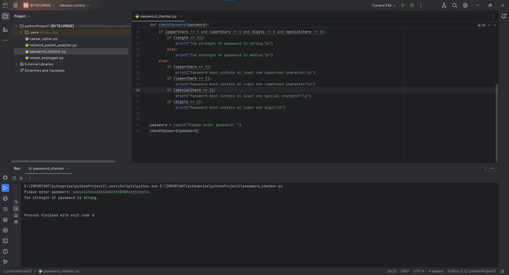

# ByteUprise_task1_CyberSecurity

Excited to share my latest project: the Password Complexity Checker! Worried about online security? With this tool, you can easily assess your password's strength. Get instant feedback on factors like length, uppercase and lowercase letters, numbers, and special characters. Introducing SecureKey, ensuring your online credentials are ultra-secure. Built with Python for simplicity and effectiveness.

# About Password Complexity Checker

A Password Complexity Checker is a tool used to assess the strength and reliability of passwords. In today's digital world, strong passwords are essential for safeguarding sensitive information and preventing unauthorized access to accounts.

These checkers evaluate various aspects of a password, including its length, character diversity, and unpredictability, to determine its difficulty for potential attackers to guess or crack.

Key features of Password Complexity Checkers include length evaluation, character diversity checks, avoidance of common patterns, dictionary word detection, entropy calculation, real-time feedback, compatibility with security policies, and educational resources.

By using a Password Complexity Checker, individuals and organizations can improve the security of their accounts and sensitive information. However, it's crucial to remember that strong passwords should be complemented by other security measures like two-factor authentication for optimal protection.

# Code
This is the code which i came up with using python [Code](password_checker.py).

# Output

- Video

<video controls src="Media/password checker.mp4" title="password_checker"></video>

- Photo

